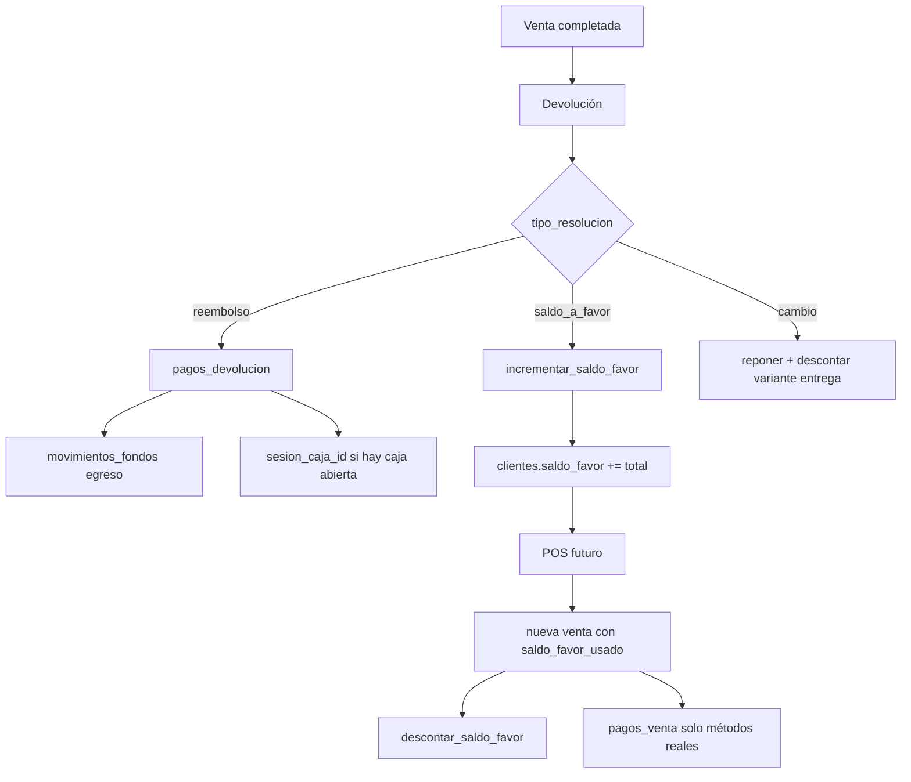

# Plan: Auditoría y corrección de devoluciones (saldo a favor vs venta / caja)

**Creado:** 2026-07-01  
**Estado:** Reemplazado por `planes/2026-07-02-auditoria-completa-devoluciones-caso-jean.md` (implementado)  
**Pedido:** Analizar cómo se gestionan las devoluciones; investigar el caso reportado donde una devolución con saldo a favor parece registrarse como venta y puede afectar la caja; cubrir todas las variantes de resolución.

---

## Descripción General

### Qué Logra Este Plan

Documenta el **comportamiento real** del módulo de devoluciones en producción (tres tipos de resolución: `reembolso`, `saldo_a_favor`, `cambio`), identifica las **brechas que explican el reporte del cliente** y propone correcciones concretas para que caja, reportes, tickets y UI muestren lo mismo que ocurre en la operación.

El resultado esperado: un cajero que devuelve con saldo a favor ve claramente una **devolución** (no una venta), la caja no muestra diferencias fantasma, y el crédito del cliente queda trazable hasta su uso en el POS.

### Por Qué Importa

- El sistema **ya está en uso con clientes reales**; un error de percepción o de arqueo erosiona confianza.
- Las devoluciones con `saldo_a_favor` tienen semántica distinta al reembolso en efectivo: **no hay egreso de caja**, pero sí hay impacto en ventas netas de reportes.
- Sin trazabilidad (`saldo_favor_usado` no persiste en `ventas`), el operador no puede reconciliar “devolví $X como crédito” con “el cliente compró usando el crédito” y puede interpretar la venta posterior como “la devolución se registró como venta”.

---

## Estado Actual

### Estructura Existente Relevante

| Capa | Archivos / artefactos |
|------|----------------------|
| **Server action** | `app/app/actions/devoluciones.ts` → `registrarDevolucion()` |
| **Ventas + saldo** | `app/app/actions/ventas.ts` → `registrarVenta()`, `anularVenta()`, RPC `descontar_saldo_favor` |
| **UI devolución** | `app/components/devoluciones/DevolucionForm.tsx`, `TablaDevoluciones.tsx`, `CambioVariantePanel.tsx` |
| **UI POS** | `app/components/pos/POSContainer.tsx`, `PanelPago.tsx`, `cobro-guiado/PasoCliente.tsx` |
| **Caja** | `supabase/migrations/20260620120003_preview_resumen_turno_devoluciones.sql`, `app/lib/caja/resumen-turno.ts`, `ResumenTurnoPanel.tsx` |
| **Reportes** | `app/lib/reportes/formulas.ts`, `referencia/reportes-definiciones-metricas.md` |
| **Dashboard** | `app/lib/dashboard/queries.ts` |
| **DB devoluciones** | `supabase/migrations/20260419000011_devoluciones.sql` (tablas, triggers stock/fondos/cliente) |
| **DB saldo a favor** | `supabase/migrations/20260510000003_saldo_a_favor.sql`, `20260603000001_revertir_saldo_favor.sql` |
| **DB cambio variante** | `supabase/migrations/20260620110001_cambio_variante_devolucion.sql` |
| **Tickets** | `build_payload_ticket_devolucion`, `TicketDevolucionRenderer.tsx` |
| **Planes previos** | `2026-04-29-modulo-devoluciones.md`, `2026-06-03-fix-devoluciones-clientes-ventas.md`, `2026-06-06-fix-caja-devolucion-vuelto.md`, `2026-06-20-auditoria-reportes-finanzas-csv-devoluciones.md` |

### Modelo de datos — tres resoluciones

| `tipo_resolucion` | Stock | Movimiento de caja | `pagos_devolucion` | `clientes.saldo_favor` | En reportes monetarios | En caja del turno |
|-------------------|-------|--------------------|--------------------|------------------------|------------------------|-------------------|
| `reembolso` | Repone (trigger) | Egreso vía trigger `mover_fondos_por_devolucion` | Sí | Sin cambio | Sí resta ventas netas | Sí, si `sesion_caja_id` asignada |
| `saldo_a_favor` | Repone (trigger) | **Ninguno** | No | `incrementar_saldo_favor` | Sí resta ventas netas | **No** (ver brecha B1) |
| `cambio` | Repone + egresa entrega (otra variante) | Sin dinero si mismo precio | No | Sin cambio | **No** (excluido) | **No** (excluido) |

### Flujo actual resumido



### Brechas o Problemas que se Abordan

| ID | Problema | Severidad | Explica reporte del cliente |
|----|----------|-----------|----------------------------|
| **B1** | `saldo_a_favor` no asigna `sesion_caja_id` — solo se calcula `sesionId` dentro del bloque `reembolso` en `registrarDevolucion` | **Alta** | La devolución **no aparece** en el resumen de turno de caja; el cajero solo ve la venta original intacta |
| **B2** | Reportes/dashboard restan `saldo_a_favor` de ventas netas; caja del turno no la resta | **Alta** | Dashboard “neto del día” ≠ caja “total neto” del turno |
| **B3** | `saldo_favor_usado` no se persiste en `ventas` ni en `pagos_venta` | **Alta** | Al usar el crédito, se crea una **venta nueva** con `ventas.total` completo; sin columna de saldo, parece “venta normal” |
| **B4** | Ticket y detalle de devolución no muestran `tipo_resolucion` | **Media** | Ticket de saldo a favor muestra “TOTAL DEVUELTO” sin aclarar “acreditado a cuenta del cliente” |
| **B5** | `ventas/[id]` muestra `venta.total` bruto; devoluciones en sección aparte | **Media** | Operador ve la venta original al monto completo → “sigue registrada como venta” |
| **B6** | `anularVenta` revierte saldo acreditado por devoluciones de esa venta, pero **no** devuelve `saldo_favor_usado` si la venta anulada consumió crédito | **Alta** | Inconsistencia contable al anular |
| **B7** | No existe `anularDevolucion` en la app (solo `estado='anulada'` en DB) | **Media** | Errores del cajero no tienen reversión guiada |
| **B8** | Venta pagada 100% con saldo: `pagos` vacío, `ventas.total` > 0, sin ingreso en `movimientos_fondos` | **Media** | Caja cuenta la venta en `total_ventas_monto` pero no hay ingreso de efectivo — correcto en efectivo, confuso en “Ventas $X” |
| **B9** | Comisiones de venta original no se revierten al devolver (documentado en `referencia/reportes-definiciones-metricas.md`) | **Baja** | Desalineación P&L, no el bug inmediato del cliente |

### Hipótesis principal del caso reportado

> “Le dejó saldo a favor, hizo una devolución, y se registró como venta.”

Escenario más probable (combinación B1 + B3 + B5):

1. Cajero procesó devolución con resolución **Saldo a favor** → registro correcto en `devoluciones`, crédito en `clientes.saldo_favor`.
2. En **caja del turno** no apareció como devolución (`sesion_caja_id = null`).
3. En **/ventas** la venta original sigue mostrando el total bruto.
4. El cliente compró de nuevo usando el saldo → **nueva venta** en POS con monto completo.
5. El operador interpretó la venta nueva como “la devolución se registró como venta”.

Escenario alternativo a descartar en auditoría: error de UI enviando `tipo_resolucion: 'reembolso'` por defecto con pagos vacíos (el servidor lo rechaza) o confusión con flujo **cambio** vs **saldo a favor**.

---

## Cambios Propuestos

### Resumen de Cambios

- **Fase 0:** Reproducir con datos del tenant afectado (SQL de diagnóstico).
- **Fase 1:** Corregir trazabilidad de caja para `saldo_a_favor` (sesión + métricas separadas).
- **Fase 2:** Persistir `saldo_favor_usado` en ventas y mostrarlo en UI/tickets.
- **Fase 3:** Claridad operativa: badges, tickets, detalle de venta con monto neto.
- **Fase 4:** Completar reversión al anular venta que usó saldo.
- **Fase 5:** Tests de regresión y actualización de documentación de métricas.
- **Fase 6 (opcional P2):** `anularDevolucion` con reversión atómica.

### Nuevos Archivos a Crear

| Ruta del Archivo | Propósito |
| ---------------- | --------- |
| `supabase/migrations/20260701000001_ventas_saldo_favor_usado.sql` | Columna `ventas.saldo_favor_usado`, constraint `>= 0`, backfill 0 |
| `supabase/migrations/20260701000002_caja_devoluciones_saldo_favor.sql` | Ajustar `preview_resumen_turno` y `cerrar_caja`: separar devoluciones en efectivo vs crédito |
| `app/lib/devoluciones/resolucion-labels.ts` | Labels y helpers UI para `tipo_resolucion` |
| `app/lib/devoluciones/flujos.test.ts` | Tests de política: qué impacta caja vs reportes |
| `salidas/checklist-auditoria-devoluciones-saldo-favor.md` | Checklist manual post-fix para operadores |

### Archivos a Modificar

| Ruta del Archivo | Cambios |
| ---------------- | ------- |
| `app/app/actions/devoluciones.ts` | Asignar `sesion_caja_id` también para `saldo_a_favor` y `cambio` si hay caja abierta (trazabilidad, sin movimiento de fondos) |
| `app/app/actions/ventas.ts` | Persistir `saldo_favor_usado` en INSERT; al `anularVenta`, RPC `incrementar_saldo_favor` por monto usado |
| `app/components/devoluciones/DevolucionForm.tsx` | Badge de confirmación post-submit; copy más explícito para saldo a favor |
| `app/components/devoluciones/TablaDevoluciones.tsx` | Columna/badge `tipo_resolucion` |
| `app/app/(dashboard)/devoluciones/[id]/page.tsx` | Mostrar resolución y saldo acreditado |
| `app/app/(dashboard)/ventas/[id]/page.tsx` | Bloque “Monto neto” (venta − devoluciones); mostrar `saldo_favor_usado` si aplica |
| `app/components/impresion/TicketDevolucionRenderer.tsx` | Sección “Acreditado como saldo a favor” cuando no hay `pagos` |
| `supabase/migrations/20260620110002_payload_devolucion_entrega.sql` (nueva migración encadenada) | Incluir `tipo_resolucion` y texto de resolución en payload |
| `app/lib/impresion/types.ts` | Campo `tipo_resolucion` en `PayloadTicketDevolucion` |
| `app/lib/caja/types.ts` | Campos opcionales `total_devoluciones_efectivo` / `total_devoluciones_credito` |
| `app/lib/caja/resumen-turno.ts` | Mapear nuevos campos del RPC |
| `app/components/caja/ResumenTurnoPanel.tsx` | Desglose devoluciones efectivo vs crédito (tooltip) |
| `app/components/pos/PanelPago.tsx` | Mostrar línea “Saldo a favor aplicado” en resumen de cobro |
| `referencia/reportes-definiciones-metricas.md` | Tabla ampliada: impacto por tipo en caja vs P&L |
| `app/types/database.ts` | Tipos actualizados |

### Archivos a Eliminar (si aplica)

Ninguno.

---

## Decisiones de Diseño

### Decisiones Clave Tomadas

1. **`saldo_a_favor` sigue sin egreso de caja**: Es correcto contablemente — la tienda no devuelve billetes, genera un pasivo (crédito al cliente). No crear `pagos_devolucion` ficticios.

2. **Asignar `sesion_caja_id` a todas las devoluciones del turno**: Permite listar la devolución en el turno sin mezclarla con egresos de efectivo. La métrica `total_devoluciones_monto` del cierre debe **separar** reembolsos en efectivo/tarjeta de créditos store.

3. **Persistir `ventas.saldo_favor_usado`**: Trazabilidad y UI; evita que una venta con crédito parezca cobrada 100% en efectivo/tarjeta.

4. **Reportes P&L mantienen política actual** (`saldo_a_favor` resta ventas netas): Alineado con `referencia/reportes-definiciones-metricas.md`. La caja debe documentar que el arqueo de efectivo no incluye créditos store.

5. **No cambiar `ventas.estado` en devolución total**: Decisión previa (`2026-06-06-gestion-devolucion-cajero`). En su lugar, mostrar **monto neto** en UI.

### Alternativas Consideradas

- **Excluir `saldo_a_favor` de ventas netas en reportes** → descartado; subestimaría devoluciones reales de mercadería.
- **Crear método de pago “Saldo a favor” con `pagos_venta`** → descartado por ahora; más invasivo, requiere método de pago sistema y movimientos de fondos virtuales.
- **Marcar devolución total como `ventas.estado = 'devuelta'`** → descartado; rompe integridad histórica y facturación.

### Preguntas Abiertas (necesitan input del usuario antes de implementar)

1. **¿El cliente hizo la devolución y la recompra el mismo día / mismo turno?** — Define si el bug es solo de UI o también de cierre.
2. **¿Pueden compartir `venta_id` o `numero_devolucion` del caso?** — Permite validar hipótesis con SQL en prod.
3. **¿Quieren `anularDevolucion` en P1 o dejarlo P2?** — Impacta alcance.
4. **En caja: ¿mostrar “devoluciones crédito” aparte o solo en tooltip?** — UX del cajero.

---

## Tareas Paso a Paso

### Paso 1: Auditoría con datos del tenant afectado

Ejecutar consultas de diagnóstico en Supabase del cliente (solo lectura) para el caso reportado.

**Acciones:**

- Buscar devoluciones recientes con `tipo_resolucion = 'saldo_a_favor'`:
  ```sql
  SELECT d.id, d.numero_devolucion, d.venta_id, d.sesion_caja_id,
         d.total_devuelto, d.created_at, d.tipo_resolucion,
         c.saldo_favor, v.numero_ticket, v.total AS venta_total
  FROM devoluciones d
  JOIN ventas v ON v.id = d.venta_id
  LEFT JOIN clientes c ON c.id = d.cliente_id
  WHERE d.tipo_resolucion = 'saldo_a_favor'
    AND d.estado = 'completada'
  ORDER BY d.created_at DESC
  LIMIT 20;
  ```
- Verificar si hubo venta posterior del mismo cliente con descuento de saldo (comparar timestamps de `clientes.saldo_favor` y ventas del cliente).
- Confirmar si `sesion_caja_id IS NULL` en la devolución del caso.
- Documentar hallazgos en `Notas de Implementación` al cerrar el plan.

**Archivos afectados:**

- Ninguno (solo lectura)

---

### Paso 2: Migración — columna `ventas.saldo_favor_usado`

**Acciones:**

- Crear `supabase/migrations/20260701000001_ventas_saldo_favor_usado.sql`:
  ```sql
  ALTER TABLE public.ventas
    ADD COLUMN IF NOT EXISTS saldo_favor_usado numeric(12,2) NOT NULL DEFAULT 0;
  ALTER TABLE public.ventas
    ADD CONSTRAINT ventas_saldo_favor_usado_nonneg CHECK (saldo_favor_usado >= 0);
  COMMENT ON COLUMN public.ventas.saldo_favor_usado IS
    'Monto del total cubierto con crédito de devoluciones previas (no genera ingreso de caja).';
  ```
- Aplicar en staging/prod antes del deploy de código.

**Archivos afectados:**

- `supabase/migrations/20260701000001_ventas_saldo_favor_usado.sql` (nuevo)
- `app/types/database.ts`

---

### Paso 3: Persistir saldo en `registrarVenta`

**Acciones:**

- En `app/app/actions/ventas.ts`, INSERT de `ventas`:
  - Agregar `saldo_favor_usado: saldoFavorUsado` cuando `saldoFavorUsado > 0`.
- Validar que `saldoFavorUsado <= total` y que el cliente tenga saldo suficiente (ya lo hace `descontar_saldo_favor`).
- En `anularVenta`, después del update a `anulada`:
  ```ts
  // Si la venta consumió saldo a favor, devolverlo al cliente
  const { data: ventaSaldo } = await supabase
    .from('ventas')
    .select('cliente_id, saldo_favor_usado')
    .eq('id', ventaId)
    .maybeSingle()
  if (ventaSaldo?.cliente_id && Number(ventaSaldo.saldo_favor_usado) > 0) {
    await supabase.rpc('incrementar_saldo_favor', {
      p_cliente_id: ventaSaldo.cliente_id,
      p_tienda_id: tiendaId,
      p_monto: Number(ventaSaldo.saldo_favor_usado),
    })
  }
  ```
- Mantener llamada existente a `revertir_saldo_favor_de_venta` (devoluciones que acreditaron saldo sobre esa venta).

**Archivos afectados:**

- `app/app/actions/ventas.ts`

---

### Paso 4: Asignar sesión de caja a devoluciones `saldo_a_favor` y `cambio`

**Acciones:**

- En `app/app/actions/devoluciones.ts`, extraer la búsqueda de sesión abierta **fuera** del bloque `reembolso`:
  ```ts
  const { data: sesion } = await supabase
    .from('sesiones_caja')
    .select('id')
    .eq('tienda_id', tiendaId)
    .eq('estado', 'abierta')
    .maybeSingle()
  const sesionId = sesion ? (sesion as { id: string }).id : null
  ```
- Para `reembolso` con efectivo: mantener validación “caja abierta obligatoria”.
- Para `saldo_a_favor` y `cambio`: usar `sesionId` si existe (opcional, no bloquear si no hay caja).
- INSERT cabecera siempre con `sesion_caja_id: sesionId` cuando corresponda.

**Archivos afectados:**

- `app/app/actions/devoluciones.ts`

---

### Paso 5: Migración — caja con devoluciones efectivo vs crédito

**Acciones:**

- Crear `supabase/migrations/20260701000002_caja_devoluciones_saldo_favor.sql`.
- En `preview_resumen_turno` y `cerrar_caja`:
  - `total_devoluciones_efectivo`: suma de `pagos_devolucion` del turno (o devoluciones `reembolso` con pagos).
  - `total_devoluciones_credito`: suma de `devoluciones` con `tipo_resolucion = 'saldo_a_favor'` del turno.
  - `total_devoluciones_monto` para **total neto de caja** = solo efectivo/reembolso real (excluir `saldo_a_favor` del cálculo de `total_neto` orientado a arqueo).
  - Mantener campo agregado `total_devoluciones_credito` visible en UI para trazabilidad.
- Actualizar `app/lib/caja/types.ts` y `resumen-turno.ts`.
- Actualizar `ResumenTurnoPanel.tsx` con segunda línea bajo Devoluciones: “Reintegros $X · Créditos store $Y”.

**Archivos afectados:**

- `supabase/migrations/20260701000002_caja_devoluciones_saldo_favor.sql` (nuevo)
- `app/lib/caja/types.ts`
- `app/lib/caja/resumen-turno.ts`
- `app/components/caja/ResumenTurnoPanel.tsx`
- `app/lib/caja/resumen-turno.test.ts` (ampliar)

---

### Paso 6: UI — claridad en devoluciones y ventas

**Acciones:**

- Crear `app/lib/devoluciones/resolucion-labels.ts`:
  ```ts
  export const RESOLUCION_LABELS = {
    reembolso: 'Reembolso',
    saldo_a_favor: 'Saldo a favor',
    cambio: 'Cambio',
  } as const
  ```
- `TablaDevoluciones.tsx`: badge con `tipo_resolucion`.
- `devoluciones/[id]/page.tsx`: card “Resolución: Saldo a favor — acreditado al cliente”.
- `ventas/[id]/page.tsx`:
  - Calcular `totalDevuelto = sum(devoluciones completadas ≠ cambio)`.
  - Mostrar KPI: `Total venta`, `Devuelto`, `Neto`.
  - Si `venta.saldo_favor_usado > 0`, línea en pagos: “Saldo a favor aplicado”.

**Archivos afectados:**

- `app/lib/devoluciones/resolucion-labels.ts` (nuevo)
- `app/components/devoluciones/TablaDevoluciones.tsx`
- `app/app/(dashboard)/devoluciones/[id]/page.tsx`
- `app/app/(dashboard)/ventas/[id]/page.tsx`
- `app/lib/ventas/queries.ts` (incluir `saldo_favor_usado` en query de detalle)

---

### Paso 7: Ticket de devolución — mostrar resolución

**Acciones:**

- Nueva migración `20260701000003_payload_devolucion_tipo_resolucion.sql` que extienda `build_payload_ticket_devolucion` con:
  - `tipo_resolucion`
  - `texto_resolucion` (ej. “Acreditado como saldo a favor del cliente”)
- Actualizar `PayloadTicketDevolucion` y `TicketDevolucionRenderer.tsx`:
  - Si `tipo_resolucion === 'saldo_a_favor'`, bloque después del total:
    ```
    Acreditado a cuenta del cliente
    (saldo a favor para próximas compras)
    ```
  - Si `cambio`, texto “Cambio de producto — sin reintegro”.

**Archivos afectados:**

- `supabase/migrations/20260701000003_payload_devolucion_tipo_resolucion.sql` (nuevo)
- `app/lib/impresion/types.ts`
- `app/components/impresion/TicketDevolucionRenderer.tsx`

---

### Paso 8: Tests de regresión

**Acciones:**

- `app/lib/devoluciones/flujos.test.ts`:
  - `saldo_a_favor` es devolución monetaria en reportes (`esDevolucionMonetaria`).
  - Política caja: crédito no resta `efectivo_esperado`.
- Ampliar `app/lib/caja/resumen-turno.test.ts` con payload RPC que incluya split efectivo/crédito.
- Caso integración manual documentado en checklist:
  1. Venta $10.000 efectivo.
  2. Devolución $10.000 saldo a favor.
  3. Verificar: devolución en `/devoluciones`, saldo cliente $10.000, caja efectivo sin egreso.
  4. Nueva venta $10.000 con saldo → venta con `saldo_favor_usado=10000`, pagos $0.
  5. Cierre: ventas $20.000 bruto, créditos $10.000, reintegros $0, efectivo coherente.

**Archivos afectados:**

- `app/lib/devoluciones/flujos.test.ts` (nuevo)
- `app/lib/caja/resumen-turno.test.ts`
- `salidas/checklist-auditoria-devoluciones-saldo-favor.md` (nuevo)

---

### Paso 9: Documentación

**Acciones:**

- Actualizar `referencia/reportes-definiciones-metricas.md` sección “Caja — resumen de turno” con split efectivo/crédito.
- No requiere cambio en `CLAUDE.md` (sin comando nuevo).

**Archivos afectados:**

- `referencia/reportes-definiciones-metricas.md`

---

## Conexiones y Dependencias

### Archivos que Referencian Esta Área

- `app/lib/dashboard/queries.ts` — KPIs devoluciones (incluye `saldo_a_favor`)
- `app/lib/reportes/queries.ts`, `queries-ventas.ts` — P&L y gráficos
- `app/components/dashboard/UltimasDevolucionesCard.tsx`
- `app/app/(dashboard)/devoluciones/nueva/page.tsx`
- `app/app/(dashboard)/ventas/[id]/page.tsx` — botón Devolver
- `supabase/migrations/20260620120001_reporte_historico_ganancia_neta.sql` — ganancia neta

### Actualizaciones Necesarias para Consistencia

- Email cierre caja (`app/lib/email/templates/cierre-caja.ts`) si muestra solo `total_devoluciones_monto` — alinear con split.
- `CierreCajaRenderer.tsx` — mismos campos que `ResumenTurnoPanel`.
- Planes obsoletos en borrador: `2026-06-06-fix-caja-devolucion-vuelto.md` puede marcarse superseded por este plan para saldo a favor.

### Impacto en Flujos de Trabajo Existentes

- Cajeros verán devoluciones saldo a favor en el turno (cantidad) sin que baje el arqueo de efectivo.
- Dueños: reportes mensuales sin cambio de política; caja más clara.
- `/implementar` debe aplicar migraciones SQL **antes** del deploy de la app.

---

## Lista de Validación

- [ ] SQL de diagnóstico ejecutado; hipótesis del caso confirmada o descartada
- [ ] Devolución `saldo_a_favor` aparece en listado del turno con `sesion_caja_id` poblado
- [ ] Caja: `total_neto` no resta créditos store del arqueo de efectivo
- [ ] Caja: línea visible “Créditos store” con monto de devoluciones saldo a favor del turno
- [ ] Venta con saldo muestra `saldo_favor_usado` en detalle y POS
- [ ] Ticket devolución saldo a favor dice “Acreditado a cuenta del cliente”
- [ ] Detalle venta muestra monto neto (venta − devoluciones)
- [ ] `anularVenta` devuelve `saldo_favor_usado` al cliente
- [ ] Tests `flujos.test.ts` y `resumen-turno.test.ts` pasan
- [ ] Checklist manual en `salidas/checklist-auditoria-devoluciones-saldo-favor.md` completado
- [ ] `referencia/reportes-definiciones-metricas.md` actualizado

---

## Criterios de Éxito

1. Un operador que procesa devolución con saldo a favor ve el comprobante en `/devoluciones`, el crédito en el cliente, y **no** interpreta el flujo como una venta nueva.
2. El cierre de caja del turno cuadra el efectivo físico sin restar créditos store como si fueran billetes devueltos.
3. Una venta pagada con saldo a favor queda auditada (`ventas.saldo_favor_usado`) y se distingue visualmente de una venta cobrada en efectivo/tarjeta.
4. Dashboard/reportes y caja documentan explícitamente la diferencia entre reintegro y crédito store.

---

## Notas

### Matriz completa de escenarios (referencia para QA)

| Escenario | Tabla afectada | Efecto en caja efectivo | Efecto en ventas netas reporte |
|-----------|----------------|-------------------------|--------------------------------|
| Devolución parcial reembolso efectivo | `devoluciones` + `pagos_devolucion` | −monto | −monto |
| Devolución total reembolso tarjeta | idem | −monto (cuenta tarjeta) | −monto |
| Devolución saldo a favor | `devoluciones` + `clientes.saldo_favor` | 0 | −monto |
| Devolución cambio misma variante | `devoluciones` | 0 | 0 |
| Devolución cambio otra variante mismo precio | `devoluciones` + stock | 0 | 0 |
| Venta usando 50% saldo + 50% efectivo | `ventas` + `pagos_venta` | +50% efectivo | +100% bruto, neto según devoluciones del mes |
| Venta 100% saldo a favor | `ventas.saldo_favor_usado` | 0 ingreso | +monto bruto |
| Anular venta que tuvo devolución saldo a favor | `ventas` + RPC revertir | sin cambio directo | revierte crédito otorgado |
| Anular venta que consumió saldo | `ventas` + incrementar saldo | sin cambio directo | revierte consumo de crédito |

### Relación con planes previos

- `2026-06-06-fix-caja-devolucion-vuelto.md` (borrador): cubre vuelto POS y reembolso efectivo; **no** cubre saldo a favor.
- `2026-06-03-fix-devoluciones-clientes-ventas.md`: `revertir_saldo_favor_de_venta` ya implementado.
- `2026-06-20-auditoria-reportes-finanzas-csv-devoluciones.md`: política reportes ya unificada; este plan cierra el gap **caja ↔ saldo a favor**.

### P2 fuera de alcance inmediato

- `anularDevolucion` con reversión de stock, saldo y fondos.
- Método de pago sistema “Saldo a favor” en `pagos_venta` para unificar mix de pagos.
- Reversión automática de comisiones en ventas devueltas (B9).
